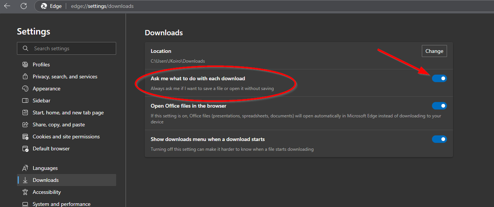
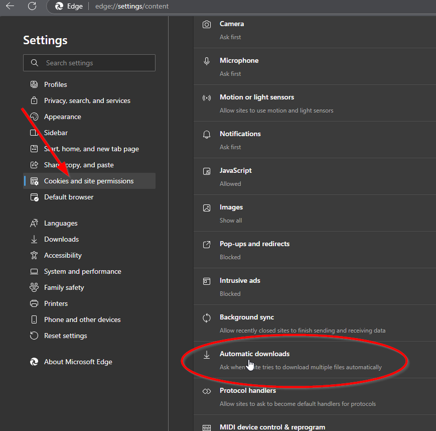
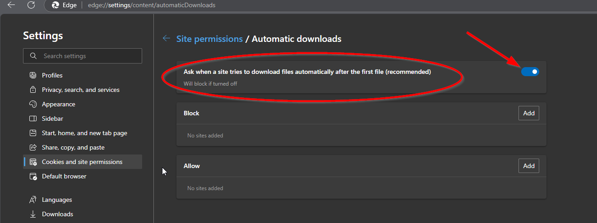
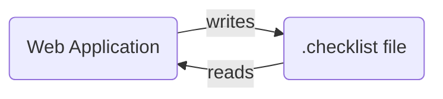
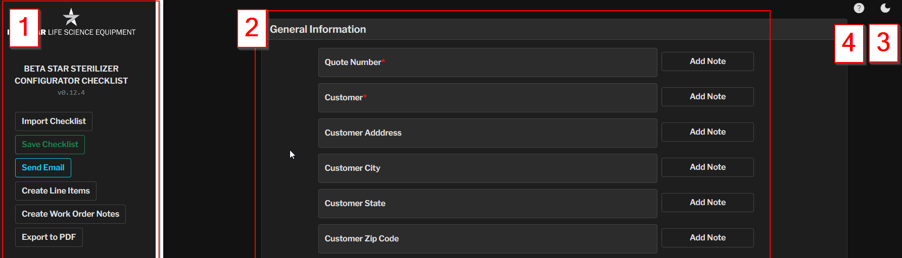
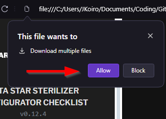
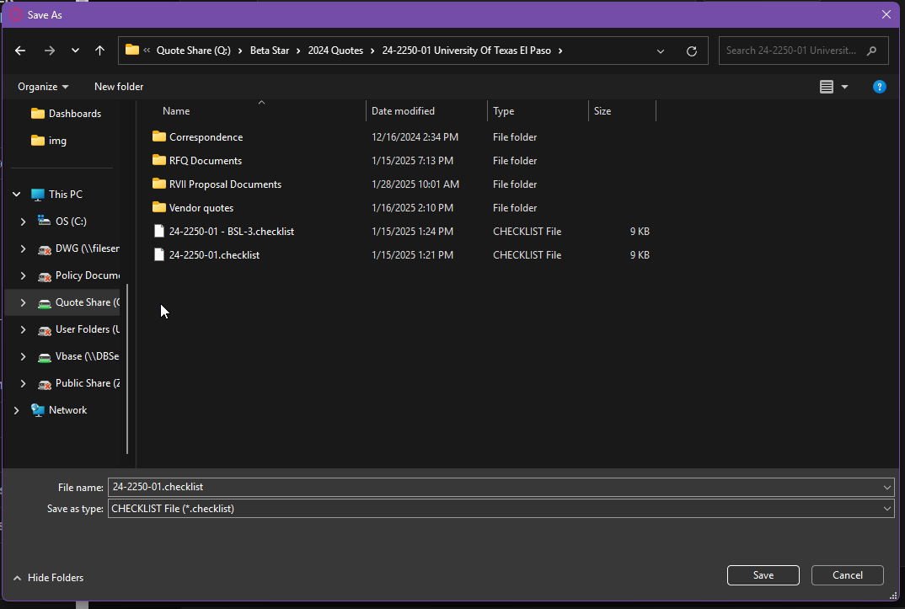
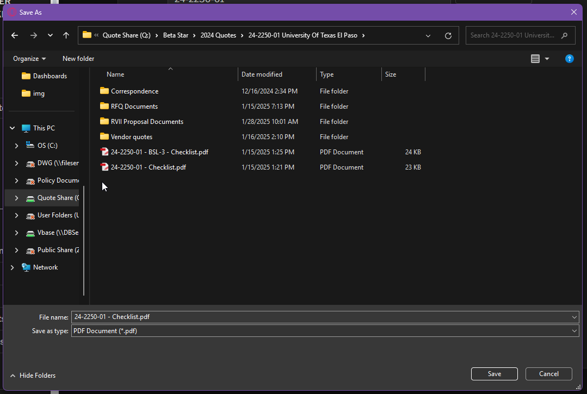
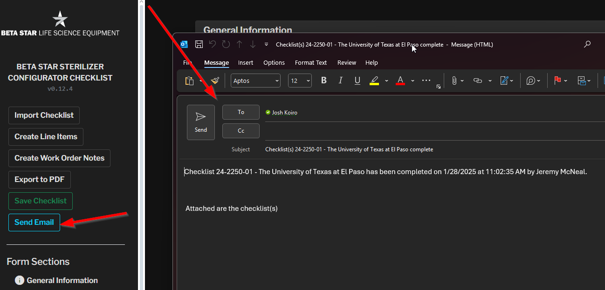

# Beta Star Sterilizer Configurator - User Guide

## Pre-Requisites

Make sure that you are using Microsoft Edge or Google Chrome for minimizing potential issues with the configurator application. While other browsers will work as well, some of the settings required to make the configurator work most effectively may not be available.

Please set the following settings in your browser to ensure that saving the .checklist file works properly.

### Download Settings
Make sure to configure the browser to always ask where to save a file that is being downloaded. This can be done by going into your browser settings under `Downloads`. Make sure the setting `Ask where to save each file before downloading` is turned on.



Use this link if you are using Edge:
[edge://settings/downloads](edge://settings/downloads)

Use this link if you are using Chrome:
[chrome://settings/downloads](chrome://settings/downloads)

### Downloading Multiple Files
Optionaly, you may also enable downloading multiple files as this will allow you to save the `.checklist` file and the `.pdf` file when saving.

This is found under the `Cookies and site permissions` and `Automatic Downloads`



After clicking on `Automatic Downloads` make sure the setting for `Ask when a site tried to download files automatically after the first file` is turned on.



Use this link if you are using Edge: 
[edge://settings/content/automaticDownloads](edge://settings/content/automaticDownloads)

Use this link if you are using Chrome:
[chrome://settings/content/automaticDownloads](chrome://settings/content/automaticDownloads)
## Getting Started
The Beta Star Sterilizer Configurator is a web-based tool that helps you configure and document sterilizer specifications. This guide will walk you through its features and best practices.

The structure of the new checklist is that of an application and save-file as shown in the diagram below:



The .checklist files are stored on the quote drive in the appropriate quote folder for the project. These files and saved and opened by the web application (configurator) that is stored under the `/Beta Star Checklists` sub-folder of the Beta Star folder.

### Opening the Application
1. Locate the configurator's HTML file on your computer or on the public drive (Q:/Beta Star/Beta Star Checklists/sterilizer-configurator.html)
2. Double-click the file to open it in your default web browser
3. The application will display with a navigation sidebar on the left and the main configuration form on the right

**Best practice would suggest that you create a shortcut to this file on your desktop. This will allow you to always be able to open the latest configurator file. Do not copy the file as updates will not persist to the copied version.**

### Interface Overview



- **(1) Sidebar:** Navigation links and action buttons.
- **(2) Main Form:** Configuration fields and options
- **(3) Theme Toggle:** Switch between light and dark modes
- **(4) Help Toggle:** Access the help documentation

## Basic Usage
### Required Fields
- Required fields are marked with a red asterisk (*)
- You must complete all required fields before using most features
- The form will highlight any missing required fields when you attempt to proceed

### Navigation

- Use the sidebar links to quickly jump between different sections
- For mobile devices or small screens: Click the menu icon to show/hide the sidebar
- Scroll through the main form to view all configuration options

### Adding Notes

Each field has an "Add Note" button on the right
Click to expand a text area where you can add specific comments or details

Notes are automatically included in exports for estimator and work order documentation.

### Managing Options

The configurator allows you to designate certain items as optional features for the sales proposal, rather than including them in the base price.

To mark items as options:

1. Look for the "Option" checkbox next to eligible items
2. Check the box to designate the item as optional
3. For dropdown fields, selecting "Option" reveals multiple checkboxes for different optional configurations


Optional items appear under "Additional Options" in the Line Items report instead of the selected items section.

### Using Help Features

- Look for question mark (?) icons to the left of the fields
- Hover over these icons to view helpful tooltips
- Tooltips provide context about the purpose and impact of each selection


## Managing Checklists
### Saving Your Work

To save your configuration:

1. Click "Save Checklist" in the sidebar
2. Your browser will prompt you to save two files:
    - A .checklist file (configuration data)
    - A PDF version of the checklist
3. If prompted about downloading multiple files, select "Allow"



Choose a location to save the file (e.g., quote folder or desktop to attach to email later)



After saving the .checklist file, a second dialog will appear confirming where you would like to save the .pdf version of the checklist. Good practice would suggest to place it in the same location as the .checklist file.



### Loading Saved Checklists
You can load an existing checklist in two ways:

1. Click "Import Checklist" and select your .checklist file
2. Drag and drop a .checklist file directly onto the web form

### Naming Conventions
For clear organization, especially with multiple units, use this format:

```
[quote number] - [machine size/equipment number].checklist
```
Examples:
```
24-9999-01 - LSII202038.checklist
24-9999-01 - 262639.checklist
```
or:
```
24-9999-01 - EQ1.2.checklist
24-9999-01 - EQ1.3.checklist
```
## Output Features
### Email Generation

1. Click "Send Email" to create a pre-populated email
2. The system automatically includes relevant configuration details
3. Attach your saved checklist files or note their location



### Line Item Creation

- Use "Create Line Items" to generate standardized descriptions for sales proposals
- These descriptions serve as defaults unless otherwise specified in the notes field

### Generating Work Order Notes

- Click "Generate Work Order Notes" before job kickoff
- This combines all equipment details and notes into a formatted text block
- The generated text can be inserted directly into the company database

### PDF Export

- The "Export to PDF" button creates a PDF version of your checklist
- This function is automatically done through the "Save Checklist" process

## Best Practices

- Save your work frequently
- Complete all required fields before generating outputs
- Use notes to document important details or special requirements
- Create separate checklists for different unit configurations
- Follow the naming conventions for multiple units
- Review selections and options before sharing or submitting

## Troubleshooting
If you encounter issues:

- Verify all required fields are completed
- Ensure you're using the latest version of the configurator
- Try refreshing the page
- Contact maintainer if persistent issues occur